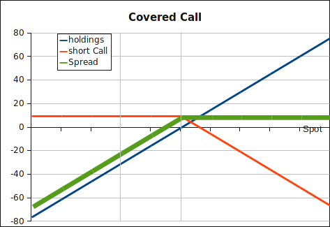

Write (sell) [call](../instruments/call-option.html)
options on equities. The option premium earned can provide stable cash flows.
The problem is that this strategy is comparable to a short put: asymmetric risk.
That is, limited upside potential, but unlimited downside potential.
`Be warned!`

The payoff of a covered call strategy:

