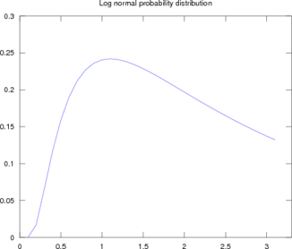

$$mean=e^{a+0.5b^2}$$

$$variance=e^{2a+b^2}*(e^{b^2}-1)$$

$$ pdf(x) = \frac{1}{\sqrt{2\pi}bx} \exp{(-\frac{1}{2b^2}*{(ln(x)-a)}^2)} $$

where $$x>=0$$

Two parameters: $$a$$, location; $$b > 0$$ its scale.

Code to reproduce this plot in `octave`:


p=lognpdf([0:0.1:3],1,1);
plot(p);
axis([0,33,0,0.3]);
title("Log normal probability distribution");
for i=1:7
    xl{i}=num2str(x((i-1)*5+1));
end
xl{8} = ' ';
set(gca, 'XTicklabel', xl);
print('lnpdf.ps', '-dpsc2');
# convert lnpdf.ps -trim -resize 70% lnpdf.png
    
