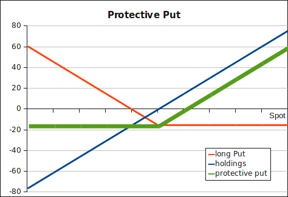

Buy a [put](../instruments/put.html) option to protect
a portfolio from downside risk. You lose at most the premium paid for the put
option, but you participate if the underlying is gaining in value.

The payoff from a protective put strategy:

