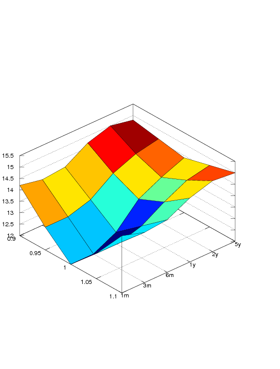

see chapter 18 in <a title="Hull: Options, Futures and other Derivatives"
href="../books/hull-options-futures-and-other-derivatives.html">Hull, Options,
Futures, and other Derivatives</a>

Given that the [Call-Put-Parity](put-call-parity.html) holds, all 
[options](../instruments/option.html), whether calls or puts,
should be of the same price. As price we mean the implied volatility of the
option if we solve the Black-Scholes-Merton formula for the volatility parameter
given all other parameters (interest rate, time to maturity, market price, ..)
known. This volatility is implied by the prices of the options and therefore
called `implied volatility`.

Under the non-arbitrage argument the prices of puts and calls should be the
same. However, as we compare market prices of such options and solve the BSM
formula for the implied volatility we observe significant deviation from zero
difference.

TODO: [ here follows a picture ]

<strong><em>Smile</em></strong>

One argument for the SMILE is that the [Black-Scholes-Merton formula](black-scholes-merton.html)
implies a static volatility whereas in real world this is certainly to move
every day. Another argument is that the BSM formula depends on lognormal
distributed returns whereas real world options' returns deviate from this
distribution. Empirically it has been shown that the lognormal distribution
underestimates the heavy tails and thus the occurrence of rare events. This
would enable an arbitrageur to collect a premium if she would buy deep out of
the money put and call options as these are priced too cheap. On the rare event
it will pay off.

<em><strong>Smirk</strong></em>

The implied volatilities of puts and calls having the same degree of moneyness
can also deviate. In this situation we call the volatility smile a smirk as it
is left skewed.

[ here follows a picture ]

Reasons for this can be that shorting of the underlying instrument can be more
expensive or simply, investors afford more to protect the downside risk.

<strong><em>Volatility Surface</em></strong>

We can draw the implied volatility against moneyness (i.e. $$ K/S $$) and time
to maturity.

ivsurf = [
14.2, 13.0, 12.0, 13.1, 14.5;
14.0, 13.0, 12.0, 13.1, 14.2;
14.1, 13.3, 12.5, 13.4, 14.3;
14.7, 14.0, 13.5, 14.0, 14.8;
15.0, 14.4, 14.0, 14.5, 15.1;
14.8, 14.6, 14.4, 14.7, 15.0 ];
surf(ivsurf);
set(gca, 'XTickLabel', [0.9, 0.95, 1, 1.05, 1.1]);
set(gca, 'YTickLabel', ['1m'; '3m'; '6m'; '1y'; '2y'; '5y']);
set(gca, "view", [48, 44]);
print('volasurf_ch18.ps','-dpsc2');


From a set of priced options (both puts and calls) we can derive their implied
volatilities. Using some interpolation on the grid of moneyness, time to
maturity we calculate the surface of expected implied volatilities.

