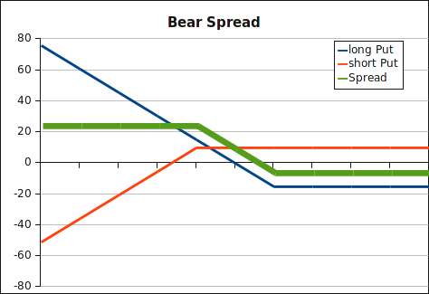

In contrast to the [bull
spread](bull_spread.html), the bear spread is a bearish view and anticipates declining prices
of the underlying. An investor sells a put with strike K1 and buys a put with
higher strike K2. 

<strong>Payoff bear spread</strong>:

