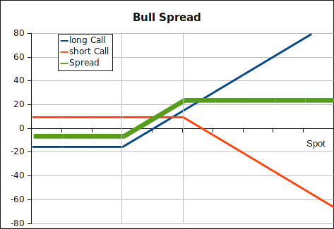

The bull spread is a bullish option trading strategy where an investor is giving
up some upside potential, but also some risk of a downside turn. The investor
receives a premium for the short call with strike K2 and pays for the long call
with strike K1. The premium K1 is below K2, and the options's maturities match.
The strategy is in profit when the spot price at expiration is between K1 and
K2.

<strong>Payoff bull spread</strong>:

