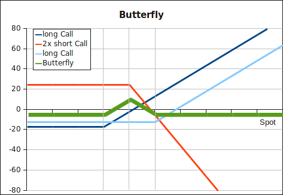

LONG: In this option trading strategy we buy a call at strike K1 and K3, and
sell two calls at strike K2 between K1 and K3. An investor of this strategy
makes a profit if the spot price of the underlying at expiration is close to K2.
But the strategy can also be shortened: we sell a call at strike K1 and K3, and
buy two calls at strike K2. We make a profit if the underlying's spot at
expiration has reasonably moved below or above K2.

<strong>Payoff long butterfly</strong>: we only make a profit at expiration if
the spot price lies between K1 and K3.

