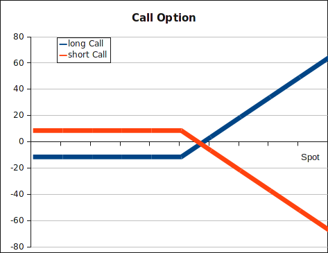

An option gives the holder of the contract the right to buy/sell an underlying
asset for a fixed price at a defined time in the futurue (termed European style
options).
<ul>
<li>it's a right and not an obligation (much like an insurance)</li>
<li>execution prior to defined date: American style option</li>
<li>a call option is the right to buy</li>
<li>a put option is the right to sell</li>
</ul>
The payout  of a <strong>call</strong> option: $$ C_T = max(0, S_T - X) $$. (S
is stock price at exerc. time, X is pre-defined strike price). A holder of the
option will only exercise his right if the price of the underlying asset is
above the strike price at time
T.

The payout of a <strong>put</strong> option: $$ C_T = max(0, X - S_T) $$. A
holder of the  option will only exercise his right if the price of the
underlying asset  is below the
strike price at time T.

The premium of an option is usually calculated using the [Black-Scholes-Merton formula](../methods/black-scholes-merton.html).

There also exist a number of "exotic" options: ...

<strong>Payout diagrams</strong>: at the maturity of the option, depending on
the spot price of the underlying, shown on the x-axis, we will realize a profit
or a loss, shown on the y-axis.

