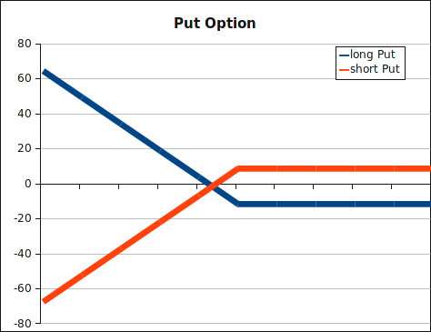

A put option is the right to sell the underlying security at a specified time in
the future for a defined price. On the other hand, the short side must accept
delivery and pay the price.

The payout diagram of a short put:

