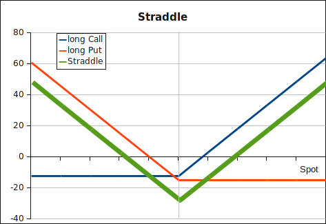

Straddles are combinations of one call and one put with the same strike price
and expiration date. This strategy costs a significant upfront investment (the
premia for the call and the put), but could end up in profit if the underlying's
spot price at expiration is above or below the strike price. One might choose
this type of option trading strategy before surprising announcements. But the
counterparty might already have priced the "big move" in the premium (higher
implied volatility) of the options.
If the same strategy is shortened, i.e. short put and short call, the payoff is
inverted: limited profit, but unlimited loss in case of a big move.

<strong>Payoff straddle</strong>: 

