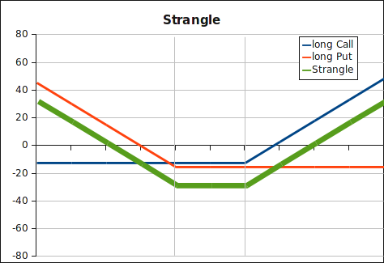

Similar to the [straddle](straddle.html), with this
option trading strategy an investor bets on large price move of the underlying.
It is cheaper than a straddle because we buy the put and the call with different
out-of-the-money strikes. 

<strong>Payoff strangle</strong>:

